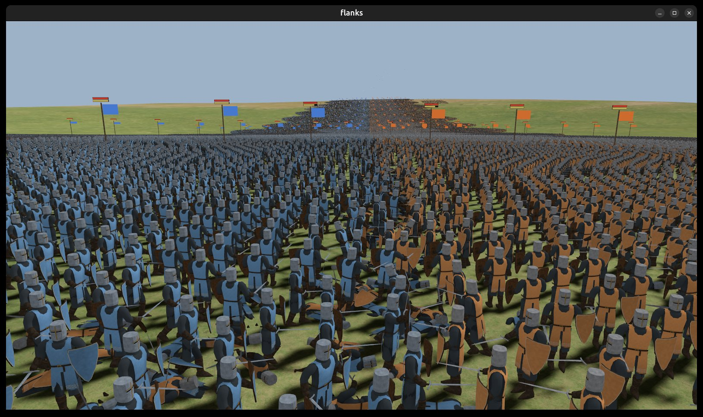

# FLANKS

FLANKS is a real-time medieval battle game written in Rust and Bevy, inspired by Medieval II: Total War.
Every soldier on the field is individually simulated, and battles can scale up to a few hundred thousand soldiers (200k tested on an RTX 3090). It is an early prototype under active development.

## Features

- Two armies of up to 100 units each, 1,000 soldiers per unit
- Army size selectable in the menu, from 10k to 200k soldiers in total depending on your hardware
- Customize your army before the battle, set the enemy army by hand, pick one of five styles for it or leave it random, then deploy your units inside your zone
- Unit orders that keep formations intact: lasso or box selection, move and attack orders, battle lines drawn by dragging
- Formations: shield wall, spear wall, loose order, hold position
- Melee combat with swing timers, directional defense, charge impact and spear walls
- Archer units with fire at will and skirmish modes; arrows hit whoever they land on, friends included
- Morale and fatigue systems: units waver, rout, rally or shatter
- An AI opponent; the battle ends when one army breaks
- Textured 3D soldiers (knights, men-at-arms, spearmen and bowmen) with four levels of detail, animated on the GPU
- Sun shadows over the ground and the soldiers
- Three maps: a grassland with trees and textured ground, the classic field from 0.1.0, and an experimental river map
- Unit cards, banners, selection rings under each soldier, a balance of power bar, and a unit panel showing each unit's state, morale and fatigue
- Positional battle audio: marching, clashing steel, war cries, melee voices, horns, victory cheers and routing shouts

## Build and run

```sh
cargo run --profile opt-dev
```

Requires Rust 1.95 or newer. The models and ground textures are stored with [Git LFS](https://git-lfs.com/): install it before cloning, or run `git lfs pull` in an existing clone.

## Controls

| Action                          | Input                     |
|---------------------------------|---------------------------|
| Select units                    | Left click or drag (lasso, or a box in Settings) |
| Select unit cards               | Click; Ctrl + click adds or removes, Shift + click selects a range |
| Select all / infantry / missile | Ctrl + A / I / M          |
| Clear the selection             | Enter                     |
| Move / attack                   | Right click               |
| Draw a battle line              | Right drag                |
| Halt selection                  | Backspace                 |
| Shield / spear wall             | F                         |
| Loose order                     | L                         |
| Hold position                   | B                         |
| Fire at will (archers)          | T                         |
| Skirmish mode (archers)         | K                         |
| Control groups                  | Ctrl + 1..9 store, 1..9 recall |
| Begin the battle after deploying | Enter                    |
| Pan camera                      | WASD or screen edges      |
| Zoom / rotate camera            | Scroll / middle drag      |
| Pause                           | Esc                       |
| Battle HUD / unit panel / stats line and debug overlay | F1 / F2 / F3 |
| Banners and map lines           | G                         |

The Controls tab in Settings lists every binding. The Map option in the menu switches between the grassland, the classic field and the river map; `FL_MAP=classic` or `FL_MAP=river` picks one at launch. `FL_VOLUME=0` mutes the game. A set of `FL_*` environment variables configures sandbox battles and scripted test scenarios (army size, AI on/off, random seed, and so on).

## Assets

The soldier, arrow, tree and shrub models are made for this project. The ground uses three CC0 textures from [Poly Haven](https://polyhaven.com/) and a layout image made for the project; see `assets/terrain/LICENSE.md`. Everything else is generated in code. Sound effects are AI-generated (ElevenLabs), plus one [marching loop from Pixabay](https://pixabay.com/sound-effects/people-marching-loop-32908/). Audio files are covered by their respective licenses, not the source license below.

## License

FLANKS is licensed under either of

- Apache License, Version 2.0
  ([LICENSE-APACHE](LICENSE-APACHE) or http://www.apache.org/licenses/LICENSE-2.0)
- MIT license
  ([LICENSE-MIT](LICENSE-MIT) or http://opensource.org/licenses/MIT)

at your option.
